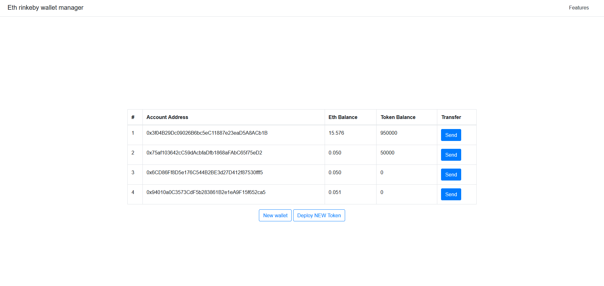

# eth-wallet-test

  

Task:

- Create simple smart-contract with couple of basic functions including Token purchasing/transfer
- Create simple web interface to interact with blockchain that should include next functionality
- Creating of the new wallet
- Ability to check ETH balance of accounts
- Ability to transfer ETH between accounts
- Ability to deploy contract that you've previously created
- Ability to send tokens from your smart-contract from one account to another
- Ability to check Token balance of accounts

Requirements are implemented using React (create-react-app) + Node.js Express stack;

Roadmap:

- [x] Simple React frontend
- [x] Node.js REST api
- [x] Web3.js connection with rinkeby ETH network
- [x] Token smart contract deployment
- [x] Transfer tokens and eth between parties
- [x] Sample test written in Mocha/Chai
- [x] Sample validation schemas (express-validator)
- [ ] Define proper error handling model (catching and rethrowing with proper codes, status etc.)
- [ ] Remove hardcode from API versioning system
- [ ] Get rid of babel-node
- [ ] Frontend is too simple :(
